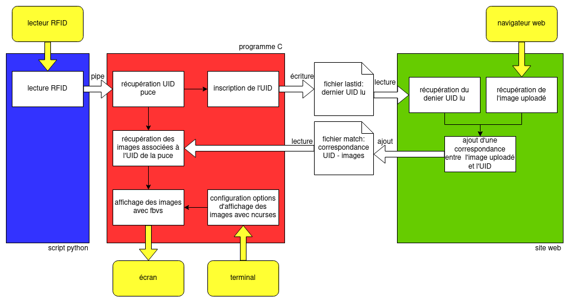
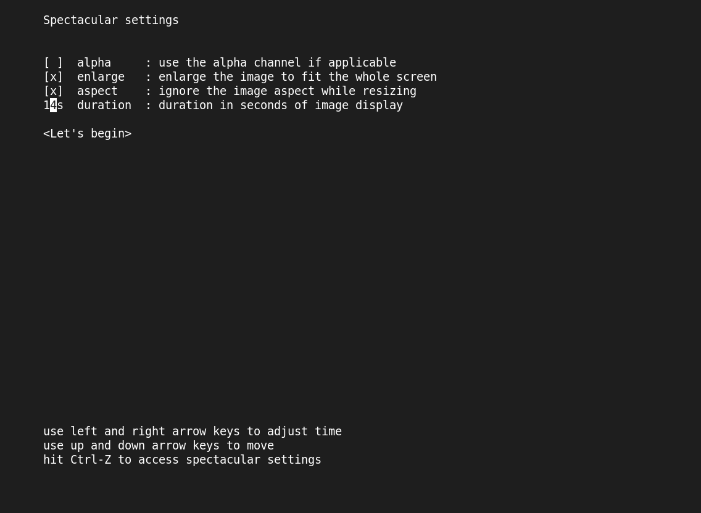
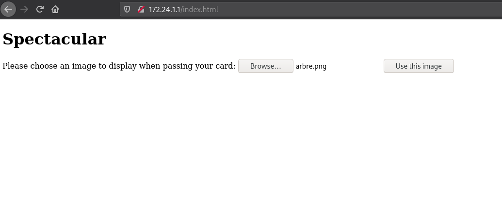

Ce projet a été mené par Mathilde et Luca, il a été rendu le 26 février 2020.

# Spectacular

Spectacular est un programme de cadre photo numérique. Il affiche des images PNG après lecture d'une puce RFID. Si aucune image n'est associée à la puce RFID lue, l'utilisateur a la possibilité d'en ajouter depuis le site web hébergé sur le Raspberry Pi.

Le chemin utilisé pour développer ce projet sous Raspberry Pi est : `/home/pi/spectacular`

## Organisation projet

```
spectacular
|____ bin		: exécutables
|____ files		: fichiers de configuration
|____ img		: images à afficher
|____ include	: fichiers d'entête C
|____ lib		: bibliothèque C
|____ script	: scripts python
|____ src		: fichiers sources C du projet
|____ www		: fichiers web du projet
```

## Compilation et exécution

Pour reproduire ce projet, assurez-vous d'avoir un serveur apache fonctionnel sur Raspberry-Pi et ajoutez la configuration de l'hôte virtuelle décrite dans Configuration Apache (il se peut qu'il faille la modifier selon le répertoire dans lequel vous placez ce projet).

Puis veillez à installer la bibliothèque SPI-Py pour être en mesure de lire les puces RFID.

Dans certains cas, il pourrait être nécessaire de recompiler le programme fbvs. Veillez à le suffixer de _pc ou _pi selon le cas.

Enfin rendez-vous dans le répertoire src puis lancez le makefile.
```
make
-- compile spectacular et place l'exécutable dans bin
-- efface le résultat d'une précédente génération avec make

make VERBOSE=yes
-- affiche les commandes du makefile et les exécute

make CROSS=yes
-- compile spectacular pour votre PC et pour Raspberry Pi mais nécessite que
-- le répertoire du compilateur croisé arm-linux-gnueabihf-gcc soit dans le PATH

make PI=yes
-- option à activer pour compiler spectacular sur Raspberry Pi

make clean
-- efface les fichier générés 
```

Pour exécuter le programme C, rendez-vous dans le répertoire bin (cette étape est nécessaire car le programme utilise des chemins relatifs lors de son exécution) et lancez l'exécution de spectacular.
```
cd /home/pi/bin
./spectacular
```

Pour que le programme se lance au démarrage de la machine, mettez les deux lignes de code précédentes dans le .bashrc, démarrez en mode console et autorisez la connection automatique de l'utilisateur pi.

## Point d'accès Wifi

Afin de pouvoir téléverser des photos vers le cadre photo, on peut mettre en place un point d'accès Wifi vers lequel se connecter. Cela a été réalisé dans le cadre du projet, le point d'accès  Wifi se nomme spectacular et autorise au plus 2 connections simultanées sans avoir besoin de renseigner un mot de passe.

## Configuration Apache

Pour proposer aux utilisateurs une page web permettant le téléversement d'image, il faut que le Raspberry Pi dispose d'un serveur http Apache. La configuration de l'hôte virtuel se trouve dans le répertoire `files` du projet.

Après avoir copié cette configuration dans le répertoire `/etc/apache2/sites-available`, on l'active:
```
$ sudo cp apache/spectacular.conf /etc/apache2/sites-available/spectacular.conf
$ sudo a2dissite 000-default
$ sudo a2ensite spectacular
$ sudo systemctl reload apache2
```

Dans le fichier `/etc/apache2/apache2.conf`, on remplace les paramètres du répertoire racine par:
```
<Directory />
  AllowOverride All
  Require all granted
</Directory>
```

## Site web téléversement d'image

Le site web hébergé sur le Raspberry Pi se compose de deux fichiers : un formulaire en HTML pour indiquer l'image à ajouter et un fichier de traitement en PHP. Le script PHP va modifier le fichier match dans le répertoire files ainsi qu'ajouter des images dans le répertoire img, assurez-vous de garantir des droits d'écriture sur ces emplacements.

Chaque image téléversée se verra attribuer un identifiant unique et sera enregistrée dans le dossier img. (Si une erreur de code 1 apparaît lors de son téléversement c'est que la taille du fichier dépasse celle indiquée dans le fichier php.ini). Puis le script PHP va récupérer l'UID de la dernière puce lue et va l'associer à la nouvelle image dans le fichier match.

Il faut s'assurer que le dossier `img` ainsi que le fichier `match` disposent des droits d'écriture nécessaires sans quoi aucune modification ne pourra s'effectuer.

## Affichage graphique

Pour l'affichage des images, on utilise le programme fbvs de Kai Stuke (https://github.com/kaihs/fbvs). Le programme a été compilé pour Fedora x86-64 et Rasperry Pi ARM (en compilation croisé). Ces versions sont disponibles dans le répertoire bin.

Ce programme affiche uniquement des images au format PNG. Il dispose de quelques options, parmi ces dernières il est possible d'activer les suivantes via l'interface ncurses de spectacular:
```
--alpha         | -a : Use the alpha channel (if applicable)
--enlarge       | -e : Enlarge the image to fit the whole screen if necessary
--ignore-aspect | -r : Ignore the image aspect while resizing necessary
```

## Lecture puce RFID

Pour lire les puces RFID, on a installé la bibliothèque python SPI-Py.
```
git clone https://github.com/lthiery/SPI-Py.git
cd ~/SPI-Py
sudo python setup.py install
```
Les bibliothèques C trouvées sont sans documentation, fonctionnent plutôt sur Arduino et n'ont pas été mises à jour depuis des décennies compliquant leur utilisation.

Grâce à la classe MFRC522 de Mario Gómez (https://github.com/mxgxw/MFRC522-python), on a pu écrire un script qui permet de retourner l'UID (Unique ID) de la puce RFID.

## Fonctionnement de spectacular


On va ici s'attarder sur le fonctionnement de certaines parties du programme C spectacular:

### Evènements
Afin d'être réactifs au différents évènements qui peuvent survenir au cours de l'exécution du programme, on met en place une boucle infinie dans laquelle un switch permet de déterminer l'état dans lequel on se trouve. Il existe 4 états:

* `WAITING` : on entre dans cet état quand on a lu toutes les images associées à une carte ou a la suite de la configuration des paramètres du programme. Dans cet état, on attend un qu'un signal intervienne;
* `RETRIEVE` : on entre dans cet état à la reception du signal SIGUSR1. Dans cet état on récupère la liste d'image associée à la dernière carte lue;
* `DISPLAY` : on entre dans cet état à la suite de l'état `RETRIEVE`. Dans cet état on affiche une à une les images associées à la dernière carte lue;
* `PARAM` : on entre dans cet état à la reception du signal `SIGTSTP` (`Ctrl-Z`). Dans cet état on autorise la modification des paramètres du programme.

### Affichage d'une liste d'image
Pour afficher une liste d'image (état DISPLAY), on fait appel à la fonction `display_image (char * img_filename, int * img_param)`. Cette fonction construit la commande pour afficher l'image puis va l'exécuter. A la suite de cela, on fait appel à la fonction `sleep()` avec en paramètre le temps d'affichage de l'image qu'a entré l'utilisatieur. Puis on réentre dans l'état DISPLAY et on affiche l'image suivante grâce à une variable de comptage dans la structure `list_images` qui permet de garder en mémoire notre position dans la liste d'images. On répète cette opération jusqu'à arriver à la fin de la liste suite à quoi on entre dans l'état WAITING.

### Récupération de l'UID de la puce RFID
Pour récupérer l'UID lu par le script Python, on va attribuer cette tâche à un processus fils qui va être à l'écoute des sorties du script. Pour cela, on crée un pipe (avec la fonction `popen(FILE *stream)`) qui va faire un `fork` et invoquer le shell pour exécuter le script Python. On récupère alors l'UID qu'on lit avec `fgets`, on l'extrait avec `strcspn` pour se débarraser du caractère de retour à ligne et enfin on écrit cet UID dans un pipe que le processus père va pouvoir lire et on lui envoye un signal SIGUSR1 afin qu'il sache qu'un changement a eu lieu et qu'on passe dans l'état RETRIEVE.

### Lecture du fichier de correspondance UID-image
Pour récupérer la liste des images associées à un UID, on utilise la fonction `fill_list_images (struct list_images * images, const char * card_id, const char * filename)`. Celle-ci va ouvrir en lecture le fichier passé en paramètre et lire toutes ses lignes à la recherche de l'UID passé également en paramètre. A chaque fois qu'on trouve l'UID demandé, on incrémente le compteur `int images->total` qui se trouve dans la structure `struct list_images`. Puis on alloue à la variable `char ** images->list` un nombre d'octets égal à `images->total * sizeof(*(images->list))` avec `calloc` de façon à stocker `int images->total` pointeurs vers les noms d'image. On recommence alors la lecture du fichier, à chaque fois qu'on retrouve l'UID demandé grâce à `strcmp` on récupère le nom de l'image qui lui est associée avec `strtok` et on duplique la chaîne obtenue avec `strdup` pour renvoyer un pointeur que l'on ajoute à `char ** images->list`. Finalement la fonction `fill_list_images ()` a modifié la structure `struct list_images` dont un pointeur a été passé en paramètre, on peut ainsi accéder à la liste des images associées à la carte `char * card_id`.

## Problèmes survenus
Lors du développement de spectacular, certains problèmes sont survenus. On détaille ici quelques solutions mise en place.

### Checkbox
Par défaut ncruses ne dispose pas de checkbox, or on voulait avoir la possibilité de sélectionner ou non certaines options. Pour cela on a construit un élément checkbox ainsi que son comportement associé pour pouvoir l'utiliser depuis notre interface textuelle. Cette partie du code a été inspirée par le projet ncurses-checklist (https://gitlab.com/sausagenoods/ncurses-checklist). Le code a été épuré et entièrement réécrit afin de ne plus comporter d'erreurs (notre compilation est très stricte avec les options -Wall -Wextra -Werror -std=c99 -pedantic) ainsi que pour mieux s'adapter à nos besoins et le rendre plus robuste.

### Lecture unique de carte RFID à lecture infinie
Au départ du projet, la lecture de la carte RFID se faisait de façon unitaire mais après avoir en discuté avec M. Bourdeaud'huy, on a mis en place la lecture en boucle de cartes RFID. Cela a nécessité de revoir certains choix de conception : en particulier, il a fallu mettre en place une boucle infinie qui permette de passer d'un état à un autre. De plus la lecture des cartes RFID réalisée par un processus fils ne posait aucun problème jusqu'alors car ce processus était le seul à envoyer un signal au processus père. Mais avec la mise de plusieurs états et notamment d'un état `PARAM` accessible sur réception du signal `SIGTSTP`, le processus fils qui lisait les cartes n'envoyait plus les identifiants des cartes après que l'utilisateur sorte de l'état `PARAM`. En effet, les deux processus reçoivent le signal `SIGTSTP` mais seul le processus père dispose d'un signal handler, il a fallu préciser avant le fork que le comportement par défaut sur réception de `SIGTSTP` est de l'ignorer afin que le processus fils ne se soucie plus de ce signal.

### Messages d'erreur
Par défaut le programme fbvs affiche un message d'erreur quand une erreur survient. Or avec un cadre photo, on se souhaite pas que des messages s'affichent si une image est absente ou mal encodée mais plutôt que le cadre photo passe les erreurs sous silence. Il a donc fallu rediriger les erreurs de fbvs afin qu'elle ne s'affiche pas à l'écran. On a trouvé la réponse à ce problème sur StackOverflow (https://stackoverflow.com/questions/27709346/hide-sh-c-error-messages-when-calling-system-in-c-linux).


## Captures d'écran spectacular




Pour en savoir plus sur notre aventure, n'hésitez pas à commander notre rapport augmenté par mail pour la modique somme de 10€.

